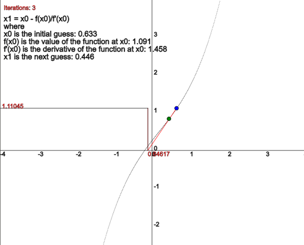

# Comprehensive Newton-Raphson Method Implementations

Welcome to my repository dedicated to providing robust implementations of the Newton-Raphson method across multiple programming languages, namely JavaScript, Python, and Rust. The Newton-Raphson method is a well-known root-finding algorithm that employs iteration to accurately determine the roots of a real-valued function.



## Table of Contents

- [Detailed Introduction](#detailed-introduction)
- [In-depth Project Structure](#in-depth-project-structure)
- [Comprehensive Getting Started Guide](#comprehensive-getting-started-guide)
    - [Prerequisites](#prerequisites)
    - [Installation](#installation)

## Detailed Introduction

The Newton-Raphson method is a highly effective numerical technique used for finding the roots of a real-valued function. It leverages the concept that a continuous and differentiable function can be approximated by a straight line tangent to it. This repository offers comprehensive implementations of the Newton-Raphson method in JavaScript, Python, and Rust, providing a valuable resource for those interested in numerical methods and their applications.

## In-depth Project Structure

This project is meticulously structured to provide clear and organized access to the various implementations:

## Project Structure

The project is structured as follows:

- [`src_js/`](src_js/): Contains JavaScript implementations of the Newton-Raphson method.
    - [`newton.js`](src_js/newton.js): A simple implementation of the Newton-Raphson method.
    - [`newton_rec.js`](src_js/newton_rec.js): A recursive implementation of the Newton-Raphson method.
    - [`newton_rec_benchmark.test.js`](src_js/newton_rec_benchmark.test.js): A benchmark test for the recursive implementation.
    - [`package.json`](src_js/package.json): Defines the JavaScript project and its dependencies.
- [`src_python/`](src_python/): Contains Python implementations of the Newton-Raphson method.
    - [`newton.py`](src_python/newton.py): A simple implementation of the Newton-Raphson method.
    - [`newton_rec.py`](src_python/newton_rec.py): A recursive implementation of the Newton-Raphson method.
    - [`newton_rec_benchmark.py`](src_python/newton_rec_benchmark.py): A benchmark test for the recursive implementation.
    - [`analysis_javascript.py`](src_python/analysis_javascript.py): Analysis script for JavaScript implementation.
    - [`analysis_python.py`](src_python/analysis_python.py): Analysis script for Python implementation.
- [`src_rust/`](src_rust/): Contains a Rust implementation of the Newton-Raphson method.
    - [`newton_rec/`](src_rust/newton_rec/): A recursive implementation of the Newton-Raphson method.
        - [`src/main.rs`](src_rust/newton_rec/src/main.rs): The main Rust source file.
        - [`Cargo.toml`](src_rust/newton_rec/Cargo.toml): Defines the Rust project and its dependencies.

## Getting Started

### Prerequisites

Before you can run the code in this repository, you need to have the following installed:

- Node.js and npm: You can download and install them from [here](https://nodejs.org/).
- Python: You can download and install it from [here](https://www.python.org/downloads/).
- Rust and Cargo: You can download and install them from [here](https://www.rust-lang.org/tools/install).

### Installation

1. Clone the repository:

```sh
git clone https://github.com/mbn-code/newton-raphson-root-finder.git
```

2. Navigate into the project directory

```sh
cd newton-raphson-root-finder
```

3. Insatll the neccessary p5 extensions ( using vscode )

    3.1 windows `ctrl + shift + x` to go to extensions
    3.1 macOS `command + shift + x` to go to extensions

    3.2 search `live p5` and install the following:
    
     

**Running The Visualisation part**

To run the visual part of this demonstration we focus on the `newton.js` file. 
This file contains the implementation of newton raphson method in p5

To run the simulation use the shortcut `ctrl + shift + p` or `command + shift + p` and type `Open live p5 panel` To get the panel to show, to load a new random polynomium (graph) use the shortcut `ctrl + s` or `command + s` which saves the file, and acts as reloading the live preview and running the script.

[](https://www.youtube.com/watch?v=oK0CTj7sJvo)

**Running the terminal scripts**

To run the javascript code simiple use `node src_js/newton_rec.js`, this is the recursive implementation of the newton raphson method which shows the method in a recursive manner.
The benchmarking script related to the `newton_rec.js` is the `newton_rec_benchmark.test.js` which is a javascript test file to test `n` amount of different functions (based on how many there are in the array) and benchmark the time it takes to find a root, based on x0 initial guess. 

When running rust you use `cargo run` in the `src_rust/newton_rec` project folder

**Running the python visualisation**

Use `python src_python/newton.py` when running the visualisation. 

**Contact Information**

- Email: malthe@mbn-code.dk
- Website: [mbn-code.dk](https://mbn-code.dk)


